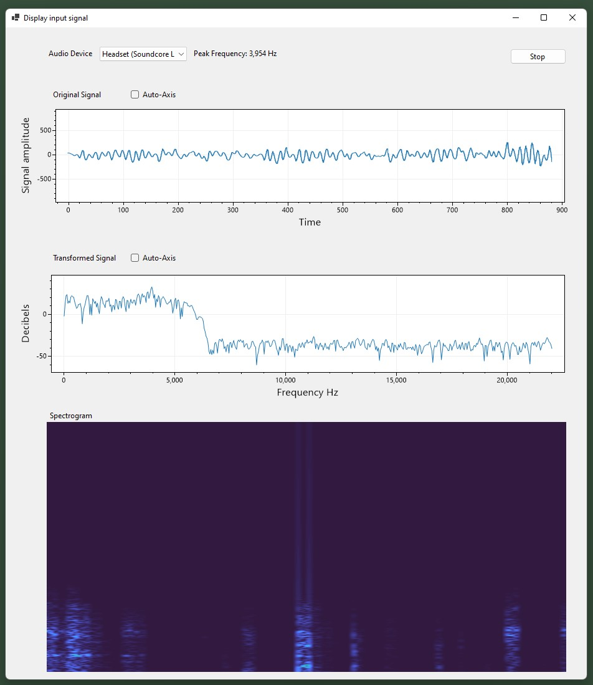
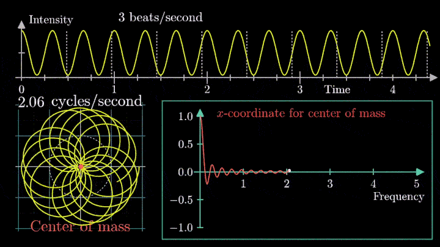
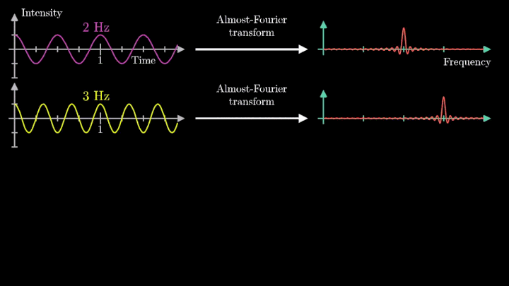

## AudioWave
Приложение для визуализации звука, захваченного микрофоном

В интерфейсе отображается три графика в реальном времени:

1. Исходный сигнал в виде синусоидальной функции, полученный от выбранного микрофона
2. Текущее отношение частоты и мощности сигнала в децибелах.
   Для формирования данного графика используется Быстрое преобразование Фурье
3. Спектрограмма звукового сигнала - так же показывает мощность звука на различных частотах в реальном времени

При реализации использованы следующие библиотеки:

1. [NAudio](https://github.com/naudio/NAudio) - требуется для взаимодействия с локальными звуковыми устройствами
2. [FftSharp](https://github.com/swharden/FftSharp) - предоставляет API для выполнения Быстрого преобразования Фурье (FFT)
3. [Spectrogram](https://github.com/swharden/Spectrogram) - используется для построения спектрограмм на основе преобразования Фурье

### Дискретное преобразование Фурье (Discrete Fourier Transform)

Данное преобразование принимает в качестве входа дискретную функцию. 
В нашем случае в качестве дискретной функции выступает результат сэмплирования входного сигнала микрофона (массив чисел с плавающей точкой).

Преобразование Фурье позволяет разложить исходный сигнал на гармонические составляющие.
Другими словами - позволяет представить сложную синусоиду в виде отдельных пиков по частотам.

